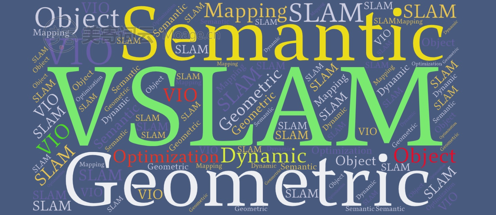

SLAM
====================================

Study Notes
-------------------------

* [Simultaneous localization and mapping (Wikipedia)](https://en.wikipedia.org/wiki/Simultaneous_localization_and_mapping)

* [SLAM Blog (CSDN)](https://blog.csdn.net/u011178262/article/category/7456224/)

* [SLAM Blog (CGABC)](https://cgabc.xyz/categories/SLAM/)

* [SLAM Notes (LaTeX on Overleaf)](https://www.overleaf.com/read/drmrxvnphrck/)

SLAM Basis
-------------------------

* Mathematics & Scientific Computing

  * https://sci.cgabc.xyz/

* Kinematics and Dynamics

* Computer Vision
  
  * https://cv.cgabc.xyz/

* State Estimation

  * https://est.cgabc.xyz/

* Multi-Sensor Fusion

  * https://msf.cgabc.xyz/

* Robotics

  * https://robot.cgabc.xyz/

Localization & Mapping
-------------------------

* SLAM Frameworks

* SLAM Odometry

  * Visual Odometry/Visual Inertial Odometry
  * Laser Odometry
  * Wheel Odometry

* SLAM Loop Closure

  * Visual Vocabulary

* SLAM Mapping

SLAM Benchmark
-------------------------

* SLAM Benchmark
* SLAM Dataset
* SLAM Simulation

SLAM Applications
-------------------------

* AR (6 DoF)
* Drone (:math:`\approx` 4 DoF)
* Ground Mobile Robot (3 DoF)

SLAM QA
-------------------------

* Experience of Running SLAM
* Engineering Tricks
* Challenge
