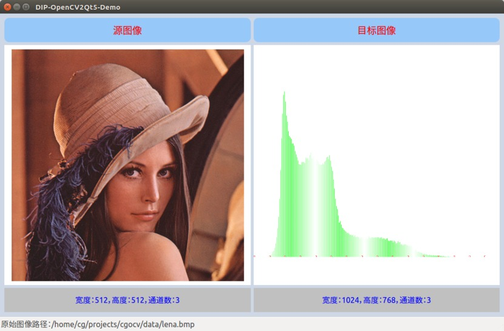

# SAI Studio

SpatialAI Studio with GUI using Qt


- Web (FastAPI & Flask)
  - https://github.com/cggos/NeuroForge/tree/main/neuro_forge/apps
- WorkFlow (NodeRed)
  - https://github.com/cggos/CyberHack/tree/main/workflow/node_red

---

<p align="center">
  
</p>

## Requirements

tested on Ubuntu 16.04 and Ubuntu 18.04

* Qt5
* OpenCV 2 (or above)

## Build & Run

* GUI
  - Qt Creator

* CLI
  
  - qmake
    ```sh
    mkdir build
    cd build

    qmake ..
    make -j4

    # run    
    ../Output/DIPDemoQt
    ```
  
  - cmake
    ```sh
    mkdir build
    cd build

    cmake ..
    make -j4

    # run    
    ./DIPDemoQt
    ```


## Computer Vision

Source Code of the Book: [*Computer Vision with OpenCV 2*](https://github.com/vinjn/opencv-2-cookbook-src "OpenCV 2 计算机视觉编程手册")

* **2D Image Processing**

  - [x] Salt and pepper noise
  - [x] Color reduce
  - [x] Image sharpening
  - [x] Color model transformation
  - [x] Histogram
  - [x] Binary image
  - [x] Look up table
  - [x] Histogram equalization
  - [x] Back Project
  - [x] Gaussian Blur(Gaussian Distribution,Gaussian Function)
  - [x] Median filtering
  - [x] Mean filtering
  - [ ] CamShift & MeanShift

* [ ] **3D Point Cloud**
