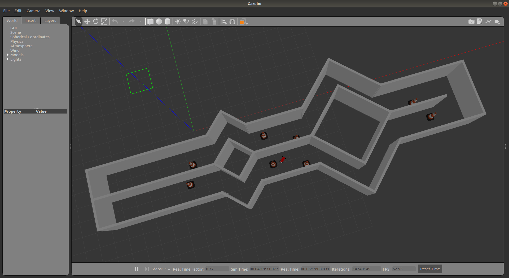
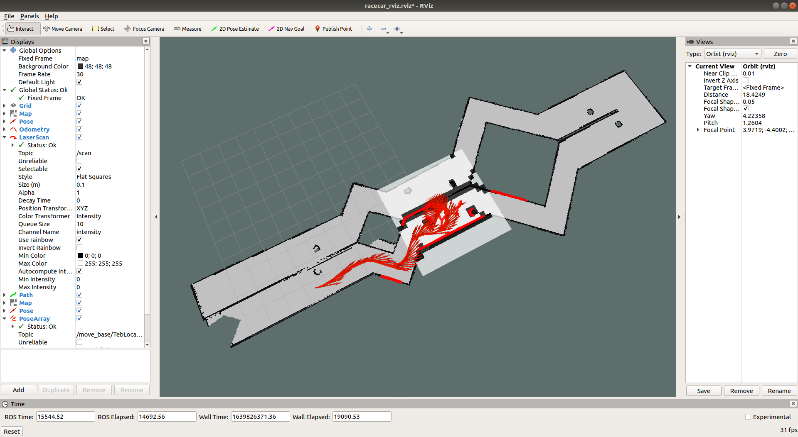
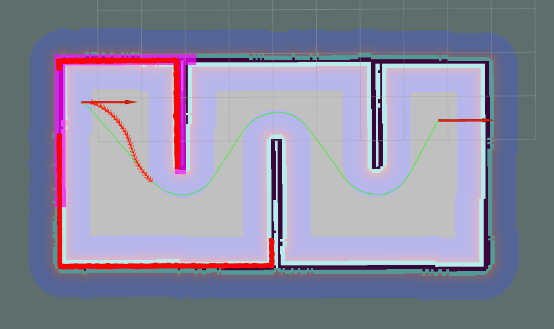
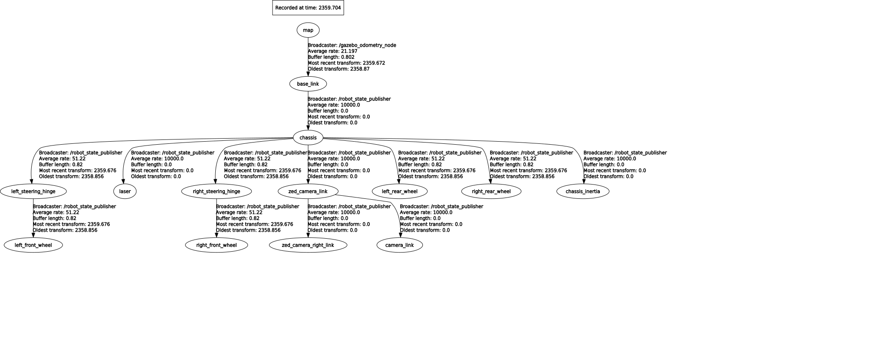

# 智能车仿真 (Racecar Simulation)

基于 [mit-racecar](https://github.com/mit-racecar) 的 ROS + Gazebo 仿真平台，支持建图、导航、循线等功能。支持两种机器人平台：**Racecar（阿克曼转向）** 和 **Turtlebot2/Kobuki（差速驱动）**。

---

## 环境要求

- ROS Melodic / Noetic
- Gazebo
- Python 3

---

## 安装依赖

在工作空间根目录 `ws_racecar/` 下执行：

```sh
rosdep install --from-paths src --ignore-src --rosdistro $ROS_DISTRO -y
```

## 编译

```sh
catkin build -DCMAKE_BUILD_TYPE=Release
source devel/setup.bash
```

---

## Racecar（阿克曼转向）

### 建图（SLAM）

<p align="center">
  
</p>

```sh
roslaunch racecar_gazebo racecar.launch world_name:=racecar_runway
roslaunch racecar_gazebo slam_gmapping.launch

rosrun map_server map_saver -f map_runway
```

### 导航（A→B）

World模型和地图
- runway
- cg

两种定位方案可选，**接口与地图文件相同，仅 Launch 文件不同**：

| 方案 | Terminal 1 | Terminal 2 | 定位来源 |
|---|---|---|---|
| Gazebo 真值（默认） | `racecar.launch` | `racecar_navigation_gz.launch` | Gazebo 仿真器直接输出，精确但不真实 |
| AMCL 粒子滤波 + Gazebo | `racecar.launch` | `racecar_navigation_amcl_gz.launch` | 激光雷达与预建地图匹配，贴近真实部署 |
| AMCL 粒子滤波 + LiDAR Odom | `racecar.launch` | `racecar_navigation_amcl_lo.launch` | 激光雷达与预建地图匹配，贴近真实部署 |

#### 方式一：Gazebo 真值定位（默认）

```sh
roslaunch racecar_gazebo racecar.launch world_name:=racecar_xxx
roslaunch racecar_gazebo racecar_navigation_gz.launch map_name:=map_xxx
rosrun racecar_gazebo path_pursuit.py
```

map_runway
<p align="center">
  
</p>

map_cg
<p align="center">
  
</p>

##### 弓形全覆盖规划
```sh
roslaunch racecar_gazebo racecar.launch world_name:=racecar_xxx
roslaunch racecar_gazebo racecar_runway_coverage.launch
rosrun racecar_gazebo path_pursuit.py
```

#### 方式二：AMCL + Gazebo Localization

使用 `map_server` 提供预建地图，AMCL 通过激光雷达扫描与地图匹配发布 `map → odom` 变换，定位流程更贴近真实机器人部署。

TF 树：`map → odom → base_link`（由 AMCL + `gazebo_odometry_odom.py` 共同维护）

```sh
roslaunch racecar_gazebo racecar.launch world_name:=racecar_xxx
roslaunch racecar_gazebo racecar_navigation_amcl_gz.launch map_name:=map_xxx
rosrun racecar_gazebo path_pursuit.py
```

> 启动后在 RViz 中使用 **2D Pose Estimate** 工具点击机器人初始位置（也可跳过，launch 文件已配置默认初始位姿），AMCL 粒子滤波会自动收敛。

#### 方式三：AMCL + LiDAR Odom

```sh
roslaunch racecar_gazebo racecar.launch world_name:=racecar_xxx
roslaunch racecar_gazebo racecar_navigation_amcl_lo.launch map_name:=map_xxx
rosrun racecar_gazebo path_pursuit.py
```


### ROS TF and Graph

ROS 坐标系：

<p align="center">
  
</p>

ROS 节点图：

<p align="center">
  
</p>


### 其他场景

| 场景 | Launch 文件 |
|---|---|
| 普通跑道 | `racecar_normal_runway.launch` |
| 停车场 | `racecar_parking_1.launch` |
| 隧道 | `racecar_tunnel.launch` |
| Walker 赛道 | `racecar_walker.launch` |
| AR 标签 | `racecar_ar.launch` |

---

## Turtlebot2 / Kobuki（差速驱动）

使用差速插件（`libgazebo_ros_diff_drive`）驱动，AMCL 定位，DWA 局部规划，接受标准 `geometry_msgs/Twist`（`/cmd_vel`）指令。

### 建图（SLAM）

```sh
# 终端 1：启动仿真 + 键盘遥控（WASD）
roslaunch racecar_gazebo turtlebot2_runway.launch
# 终端 2：GMapping + RViz
roslaunch racecar_gazebo turtlebot2_slam_gmapping.launch
# 建图完成后保存（可跳过，已内置 map_runway 地图）
rosrun map_server map_saver -f map_runway
```

### 导航（A→B）

```sh
# 终端 1：启动仿真
roslaunch racecar_gazebo turtlebot2_runway.launch
# 终端 2：加载地图 + AMCL + move_base（DWA）+ RViz
roslaunch racecar_gazebo turtlebot2_runway_navigation.launch
```

在 RViz 中使用 **2D Nav Goal** 工具点击目标点即可触发自主导航。

### 与 Racecar 的差异

| | Racecar | Turtlebot2 |
|---|---|---|
| 驱动方式 | 阿克曼（前轮转向） | 差速（双轮） |
| 控制指令 | `AckermannDriveStamped` | `Twist`（`/cmd_vel`） |
| 局部规划器 | TEB | DWA |
| 路径追踪 | `path_pursuit.py`（Pure Pursuit） | move_base 内置 |
| 定位 | Gazebo 真值 relay（默认）/ AMCL 粒子滤波（`-amcl`） | AMCL 粒子滤波 |
| 根坐标系 | `base_link` | `base_footprint` |

---

## 包结构

| 包 | 说明 |
|---|---|
| `racecar_description` | Racecar URDF/xacro 模型、传感器、3D 网格 |
| `racecar_control` | ros_control 配置，将 Ackermann 指令转发至各关节控制器 |
| `racecar_gazebo` | 仿真主包：世界文件、地图、导航参数、Python 控制节点（含 turtlebot2 配置） |
| `turtlebot2_description` | Kobuki URDF/xacro 模型（差速插件 + Hokuyo LiDAR） |
| `system/` | 第三方依赖：ackermann_msgs、vesc 驱动、ackermann_cmd_mux、hokuyo_node 等 |

---

## 导航定位方案总览

三种定位方案的 TF 链路与适用场景对比：

| 方案 | TF 链路 | 里程计来源 | 全局定位来源 | 适用场景 |
|---|---|---|---|---|
| Gazebo 真值（默认） | `map → base_link` | `gazebo_odometry.py`（Gazebo 仿真器） | 无，直接给出全局位姿 | 快速仿真调试，不关注定位真实性 |
| AMCL 粒子滤波 | `map → odom → base_link` | `gazebo_odometry_odom.py`（仿真里程计） | AMCL（激光雷达 + 预建地图） | 贴近真实部署的仿真验证 |
| VIO + AMCL（推荐真实部署） | `map → odom → base_link` | VIO 节点（视觉惯性里程计） | AMCL（激光雷达 + 预建地图） | 真实机器人 |

> **关键区别**：默认方案的 TF 根为 `map`（全局帧直接挂底盘），AMCL/VIO 方案符合 ROS nav stack 标准：`map`（全局） → `odom`（局部漂移） → `base_link`（底盘）。

---

## 接入 VIO 定位（真实机器人部署指南）

本节说明在**真实机器人**上用 VIO（Visual Inertial Odometry，如 ZED SDK 位姿追踪、VINS-Mono、OpenVINS）替代仿真里程计时，需要修改的文件和注意事项。

### 定位架构

```
方案一（VIO 里程计 + AMCL 全局定位）          方案二（VIO SLAM 全局定位，无预建地图）
─────────────────────────────────────          ────────────────────────────────────────
  VIO 节点                                       VIO SLAM 节点
    └─ 发布 odom → base_link TF                   ├─ 发布 odom → base_link TF
  AMCL                                             └─ 发布 map → odom TF（含回环）
    ├─ 读取 /map（来自 map_server）               move_base（global_costmap 改为动态）
    ├─ 读取 odom → base_link TF
    └─ 发布 map → odom TF
  move_base（保持不变）
```

### 方案一：VIO 替代里程计，保留 AMCL 全局定位

适合：有预建地图、需要激光雷达纠正 VIO 漂移的场景（推荐）。

**修改文件：`racecar_control/launch/racecar_control_amcl.launch`**

```xml
<!-- 删除（仿真里程计，真实机器人不需要）： -->
<!-- <node pkg="racecar_gazebo" name="gazebo_odometry_node" type="gazebo_odometry_odom.py"/> -->

<!-- 替换为 VIO 节点，以 ZED SDK（zed_ros_wrapper）为例： -->
<include file="$(find zed_wrapper)/launch/zed2.launch">
  <arg name="pos_tracking_enabled" value="true"/>
  <arg name="publish_tf"           value="true"/>
  <arg name="world_frame_id"       value="odom"/>
  <arg name="base_frame_id"        value="base_link"/>
</include>
```

`racecar_navigation_amcl.launch` **保持不变**，AMCL 继续提供 `map → odom`。

**ZED 关键参数说明：**

| 参数 | 值 | 含义 |
|---|---|---|
| `world_frame_id` | `"odom"` | VIO 在局部 odom 帧内给出里程计（有漂移，由 AMCL 纠正） |
| `base_frame_id` | `"base_link"` | TF 输出子帧为 base_link，满足 AMCL 输入要求 |
| `publish_tf` | `true` | ZED 自动广播 `odom → base_link` TF |

> ⚠️ **帧冲突警告**：`base_frame_id` 必须设为 `"base_link"`，**不能**设为 `"camera_link"` 或 `"zed_camera_link"`。原因：这两个帧已在 URDF TF 树中被 `robot_state_publisher` 分配了父节点（`zed_camera_link → camera_link`、`chassis → zed_camera_link`），若 VIO 再将 `odom` 设为其父节点，会产生**双父节点冲突**，TF 树崩溃。

### 方案二：VIO SLAM 替代 AMCL（无需预建地图）

适合：无预建地图、VIO 具备回环检测能力（如 ORB-SLAM3、VINS-Fusion with loop closure）。

**修改文件：`racecar_gazebo/launch/racecar_navigation_amcl.launch`**

```xml
<!-- 删除 map_server 和 amcl，替换为 VIO SLAM 节点 -->
<!-- <node name="map_server" .../> -->
<!-- <node pkg="amcl" .../> -->

<!-- 以 ORB-SLAM3 ROS wrapper 为例（立体 + IMU 模式）： -->
<node pkg="orb_slam3_ros" type="orb_slam3_ros_stereo_inertial"
      name="orb_slam3" output="screen">
  <param name="world_frame_id" value="map"/>
  <param name="odom_frame_id"  value="odom"/>
  <param name="cam_frame_id"   value="camera_link"/>
  <remap from="/camera/left/image_raw"  to="/zed/zed_node/left/image_rect_color"/>
  <remap from="/camera/right/image_raw" to="/zed/zed_node/right/image_rect_color"/>
  <remap from="/imu"                    to="/zed/zed_node/imu/data"/>
</node>
```

**同时修改 `racecar_gazebo/config/global_costmap_params.yaml`：**

```yaml
global_costmap:
  static_map: false   # 改为 false，不等待静态 /map 话题
  rolling_window: true
  width: 20.0
  height: 20.0
```

> ⚠️ 全局规划器将基于实时代价地图，规划效果取决于 VIO SLAM 的建图质量。建议先用 Gmapping 建好地图再切换，或使用 VIO SLAM 自身的 map 话题输出喂给 map_server。

### 话题与 TF 速查

```
真实机器人 VIO 集成后的完整 TF 树：

  map
   └─ odom          ← AMCL 发布（方案一）或 VIO SLAM 发布（方案二）
       └─ base_link ← VIO 节点发布（方案一/二均需要）
           └─ chassis
               ├─ left_rear_wheel / right_rear_wheel
               ├─ left_steering_hinge / right_steering_hinge
               │   ├─ left_front_wheel / right_front_wheel
               ├─ laser
               └─ zed_camera_link
                   ├─ camera_link（ZED 左目）
                   └─ zed_camera_right_link（ZED 右目）
```

| 话题 | 类型 | 发布节点 |
|---|---|---|
| `/scan` | `sensor_msgs/LaserScan` | Hokuyo 驱动 |
| `/zed/zed_node/left/image_rect_color` | `sensor_msgs/Image` | ZED wrapper |
| `/zed/zed_node/imu/data` | `sensor_msgs/Imu` | ZED wrapper |
| `/vesc/odom` | `nav_msgs/Odometry` | VIO 节点（替代 gazebo_odometry_odom.py） |
| `/amcl_pose` | `geometry_msgs/PoseWithCovarianceStamped` | AMCL（方案一） |

---

## 与 darknet_ros 集成（目标检测）

修改 `ros.yaml` 中的相机话题：

```yaml
subscribers:
  camera_reading:
    topic: /camera/zed/rgb/image_rect_color
    queue_size: 1
```

```sh
roslaunch darknet_ros darknet_ros.launch
```
